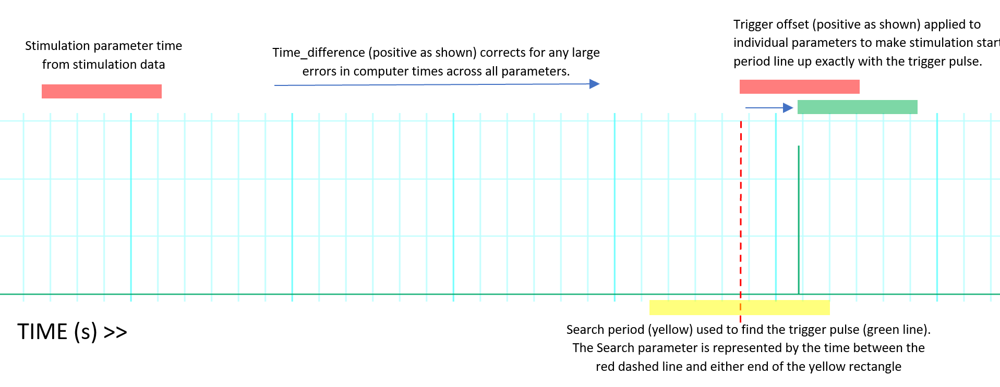

PhysResponse
============

The PhysResponse class combines physiological and stimulation data into an object that can access physiological data
across a stimulation parameter easily. The PhysResponse is very similar to the :ref:`ECAP` class, except that data
is accessed across an entire parameter instead of one stimulation pulse. This is more suitable for analyzing
physiological data such as heart rate and blood pressure because the changes often occur over a longer period of time.
An explanation of stimulation parameters can be found in the documentation for the :ref:`ECAP` class.

Instantiating a PhysResponse object can be done with a Phys object, a Stim object, and the name of a trigger channel.

.. TODO: find an example data set to use and write a .. testsetup:: directive for doctests

.. autoclass:: pyCAP.phys_response.PhysResponse
    :members:
    :special-members:

Timing Synchronization
^^^^^^^^^^^^^^^^^^^^^^

The purpose of timing synchronization is to take stimulation parameter start/stop times and convert them to times that
can be used to access the physiological data. The basic approach of pyCAP is to take start times from stimulation data,
convert them to a unix timestamp, match them with the closest trigger pulse in the physiological data, then convert the
timestamp of the trigger pulse into an elapsed time since the start of the physiological data.
Physiological data from ADInstruments and stimulation data from TDT or Ripple are often collected on different
machines. The internal timing of these machines is separate, so synchronizing the timing is extremely important in order
to ensure accurate results from data analysis. pyCAP provides several methods of time synchronization. The following are
parameters of the PhysResponse constructor and their roles in time synchronization:

- trigger_channel :
    A trigger channel is used to register changes in stimulation amplitude which indicate the start of
    a stimulation parameter. The TDT or Ripple machine can be set up to send a pulse to the ADInstruments machine whenever this occurs.
    By setting up a channel to register these pulses, small errors in timing between the two machines can be eliminated. pyCAP
    is built to find these trigger pulses in the physiological data and use them as start times for a stimulation parameter as opposed
    to using the times from the stimulation data. The stimulation data provides an approximate time to search for a pulse but not
    the exact time. If the trigger channel is passed in as None, pyCAP will use the timing of the stimulation data and
    neglect trigger pulses when determining stimulation start/end times.

- threshold :
    This is the value used to detect changes in stimulation amplitude. pyCAP iterates over values in the
    trigger channel and any values greater than the threshold are registered as possible stimulation parameters.

- search :
    This parameter is used to specify the time period to search for a pulse on the trigger channel. pyCAP pulls an
    approximate parameter start time from the stimulation data. Setting search to 1 would search the time from 1 second before
    to 1 second after the start time of the stimulation data. The pulse which is closest to the start time from the
    stimulation data is used. NOTE: search treats gap times between data sets as non-existent.

- time_difference :
    This parameter is only necessary when there is a large time difference between the computer times
    of the physiological and stimulation data. An example of this would be if one computer had changed its time because of
    daylight savings but the other computer had not. A time difference of 3600 would correct an error where the physiology data
    leads the stimulation data by 3600 seconds.

When instantiating a PhysResponse object, pyCAP will automatically search for stimulation pulses for every parameter and
generate warnings when no stimulation pulse is found. Since it can be time consuming to search for pulses in data with a
high sample rate or wide search window, all of the results are stored as trigger offsets. A trigger offset is the time
difference between the pulse found in the physiological data and the pulse time recorded in the stimulation data
after taking into account any system-wide time difference. A positive trigger offset indicates that the physiological
data leads the stimulation data. If no pulse is found on the trigger channel, the trigger
offset will become NaN. When the parameter is used, a warning will be generated and the trigger offset will be neglected.
The get_trigger_offsets, and set_trigger_offsets methods shown below can be used to view and customize the trigger offsets.

The following diagram shows how pyCAP uses system-wide time difference and trigger offsets to determine the start of a
stimulation parameter:

Customizing Trigger offsets
...........................

It is possible to analyze data with pyCAP with custom trigger offsets or without using trigger offsets at all. If ignoring
trigger offsets, set the trigger_channel parameter to None when instantiating an object or pass the compute=False
argument to the PhysResponse constructor. All trigger offsets will be initialized as 0, meaning that the only variables
used to calculate the stimulation stop and start times are stimulation data and the time_difference parameter. Warnings
about trigger pulses not being found will not appear. To pass in custom trigger offsets, create a dictionary with keys
as stimulation parameters and values as trigger offsets. Pass this dictionary to the PhysResponse constructor with the
trigger_offsets keyword argument. Be sure to set compute=False, otherwise trigger offsets will automatically be computed
based on other parameters.

Warnings
^^^^^^^^

pyCAP will warn users of data that may not be properly synchronized or is interrupted by other stimulation parameters or
block starting and ending times. The following are PhysResponse warnings:

- "No trigger pulse found for stimulation parameter {}"

- "Stimulation period interrupted by start/end of block at parameter {}"

- "block start/end period during baseline"

- "Other Stimulation period occurs during baseline"

Warnings about trigger pulse are generated when a Phys object is created. Other warnings can be generated by calling the
verify_parameters method. It is recommended to call this method on all parameters that will be used in data analysis to
ensure proper timing synchronization.

_DioEpoch
=========

The _DioEpoch class is the parent class of PhysResponse. All methods for the PhysResponse class are inherited from
_DioEpoch. The class contains getter/setter methods for each of the parameters relating to time synchronization. The
class also contains methods to access, plot, and determine change from baseline over a stimulation parameter.

.. autoclass:: pyCAP.base.dio_epoch._DioEpoch
    :members:
    :special-members: __init__

